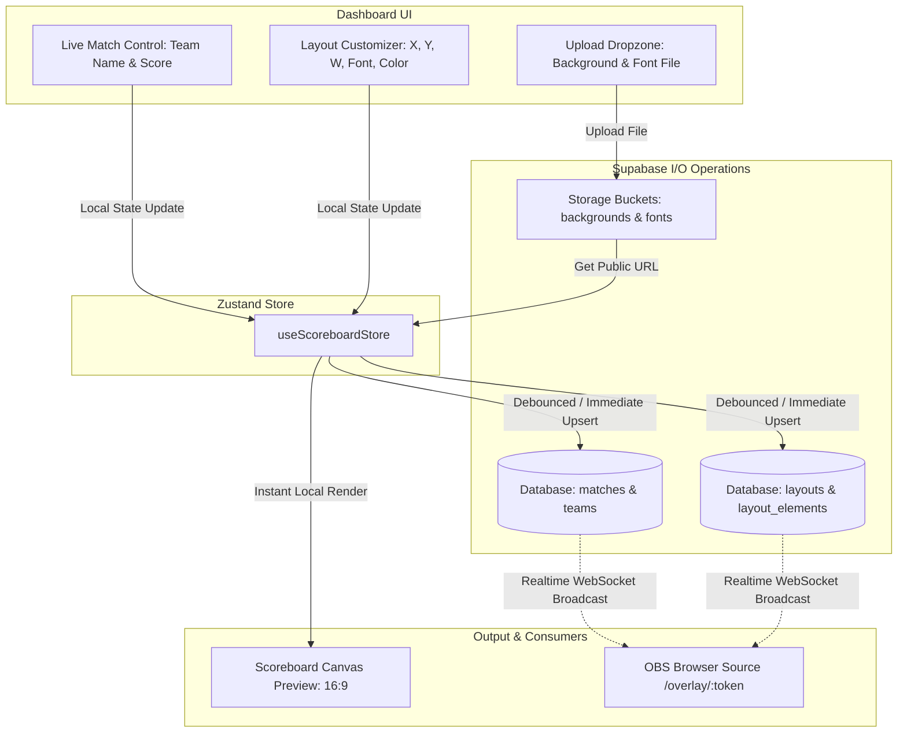

# Phase 3 Breakdown: Client-to-Database I/O & Realtime Dashboard Logic

Dokumen ini membedah arsitektur logika, alur data (Data Flow), integrasi I/O client ke Supabase, dan sinkronisasi *state* di halaman **Dashboard Panel** (`/dashboard`).

---

## 🎯 Tujuan Utama Phase 3
Menghubungkan seluruh antarmuka (UI) Dashboard yang sudah dibangun menjadi **aplikasi hidup (full-stack interactive)**:
1. Setiap perubahan input skor, nama tim, posisi koordinat, dan upload aset langsung tersimpan (I/O) ke database Supabase.
2. Memanfaatkan **Zustand** sebagai *single source of truth* di client dengan strategi *Optimistic UI Update* (UI bergerak instan tanpa jeda loading).
3. Mengaktifkan **Supabase Realtime** agar perubahan di Dashboard langsung terefleksi secara *sub-second* ke OBS Overlay preview.

---

## 🏗️ Diagram Alur Data (Data Flow Architecture)

---

## 🧩 Modul & Detail Eksekusi I/O

### 1. Centralized State Management (`store/useScoreboardStore.ts`)
Mengelola seluruh state aktif di dashboard agar terpusat dan mudah diakses antar komponen:
- **Match State:** `matchId`, `obsToken`, `status`.
- **Teams State:** `team1` & `team2` (`name`, `score`, `nameColor`, `scoreColor`).
- **Layout Config:** `fontFamily`, `customFontUrl`, `nameFontSize`, `scoreFontSize`, `backgroundImageUrl`.
- **Element Positions:** Array dari `layout_elements` (`element_key`, `pos_x`, `pos_y`, `width`, `align`, `is_locked`).
- **Loading & Sync Indicators:** `isSaving`, `lastSavedAt`, `isConnected`.

---

### 2. Panel 1: Scoreboard Preview & Asset Upload I/O
- **Background Upload:**
  - File picker / Drag-and-drop file gambar (`.png`, `.jpg`, 1920x1080).
  - Validasi ukuran file (maks. 50MB) & tipe MIME.
  - Upload langsung ke Supabase Storage bucket `backgrounds`.
  - Simpan public URL ke kolom `layouts.background_image_url`.
  - Render instan gambar ke canvas 16:9 sebagai background preview.
- **Custom Font Upload:**
  - File picker untuk `.ttf` / `.woff2`.
  - Upload ke Supabase Storage bucket `fonts`.
  - Simpan public URL ke `layouts.custom_font_url`.
  - Injeksi otomatis `@font-face` dinamis ke DOM browser agar font langsung aktif di preview.

---

### 3. Panel 2: Streaming Browser Source I/O
- **OBS Link Generation:**
  - Ambil `obs_token` yang terikat pada match aktif user.
  - Format URL: `https://velazta.live/obs/[obs_token]`.
  - Fitur *Copy to Clipboard* dengan notifikasi toast visual.
  - Tombol *Regenerate Token* (opsional) untuk mereset link OBS jika terjadi kebocoran link.

---

### 4. Panel 3 (Tab 1): Live Match Control I/O
- **Skor & Nama Tim:**
  - Tombol `+` / `-` dan direct input skor melakukan update lokal instan (Zustand).
  - Mengirim query `UPDATE` ke tabel `teams` (dengan *debouncing* 300ms untuk input teks agar hemat request API).
- **Swap Teams Button:**
  - Menukar nama, skor, dan warna antara Team 1 dan Team 2 dalam 1 transaksi atomic di database.
- **Reset Score Button:**
  - Mereset skor kedua tim menjadi `0` di database dan local state.

---

### 5. Panel 3 (Tab 2): Layout Customization I/O
- **Font Settings I/O:**
  - Slider `TEAM NAME SIZE` & `SCORE SIZE` $\rightarrow$ update `layouts.name_font_size` & `layouts.score_font_size`.
  - Color Picker `TEAM NAME COLOR` & `SCORE COLOR` $\rightarrow$ update `teams.name_color` & `teams.score_color`.
- **Element Positioning I/O:**
  - Input `X`, `Y`, `W` untuk Team 1 Name, Team 1 Score, Team 2 Name, Team 2 Score.
  - Toggle Alignment (`left`, `center`, `right`, `justify`).
  - Batch `UPSERT` ke tabel `layout_elements` berdasarkan `layout_id` dan `element_key`.
  - Perubahan angka langsung menggeser posisi elemen di Canvas Preview secara real-time.

---

## ⚡ Strategi I/O & Optimasi

| Aspek | Solusi Teknis |
| :--- | :--- |
| **Kecepatan UI (Perceived Latency)** | **Optimistic UI:** State di layar berubah dalam 0ms, lalu Supabase di-update di background. |
| **Efisiensi Request API** | **Debouncing (300-500ms):** Input slider dan pengetikan teks tidak membombardir database setiap frame/karakter. |
| **Data Safety & Integrity** | **Single Active Match Fetching:** Saat dashboard pertama kali dibuka (`useEffect`), lakukan `SELECT` match & layout default user atau buat otomatis jika belum ada. |
| **Realtime Resilience** | **Supabase Broadcast Channel:** Reconnect otomatis jika koneksi internet operator sempat terputus. |

---

## 🚀 Urutan Langkah Kerja (Step-by-Step Execution Plan)

1. **Step 3.1: State Store Setup (`store/useScoreboardStore.ts`)**  
   Membuat Zustand store lengkap dengan action setter dan hooks database.
2. **Step 3.2: Initial Data Fetcher & Auto-Seed**  
   Logic untuk memuat profil match/layout aktif saat user login ke dashboard.
3. **Step 3.3: Storage Uploader Service (`lib/supabase/storage.ts`)**  
   Fungsi upload background & font ke bucket Supabase + URL generator.
4. **Step 3.4: Wire Live Match Control ke Supabase**  
   Koneksikan input nama, tombol skor (+/-), swap, dan reset ke tabel `teams`.
5. **Step 3.5: Wire Layout Customizer ke Supabase**  
   Koneksikan font settings & input koordinat (X, Y, W, Align) ke tabel `layouts` dan `layout_elements`.
6. **Step 3.6: Dynamic Canvas Preview Rendering**  
   Hubungkan canvas 16:9 agar menampilkan preview posisi teks, font, dan background secara live sesuai koordinat.
