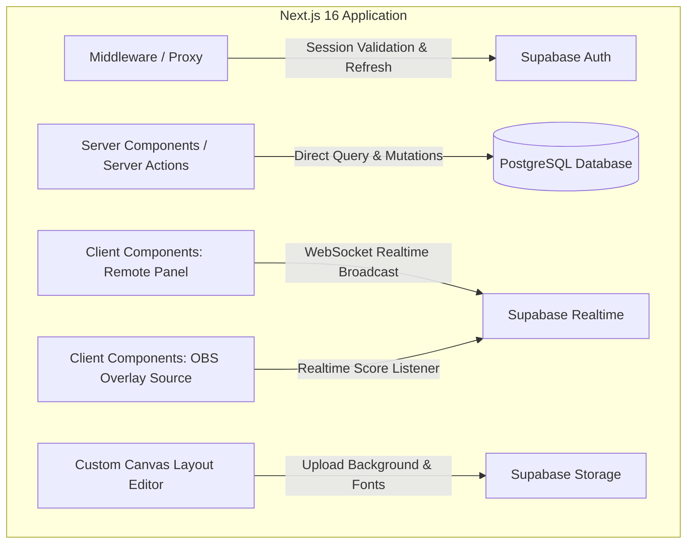
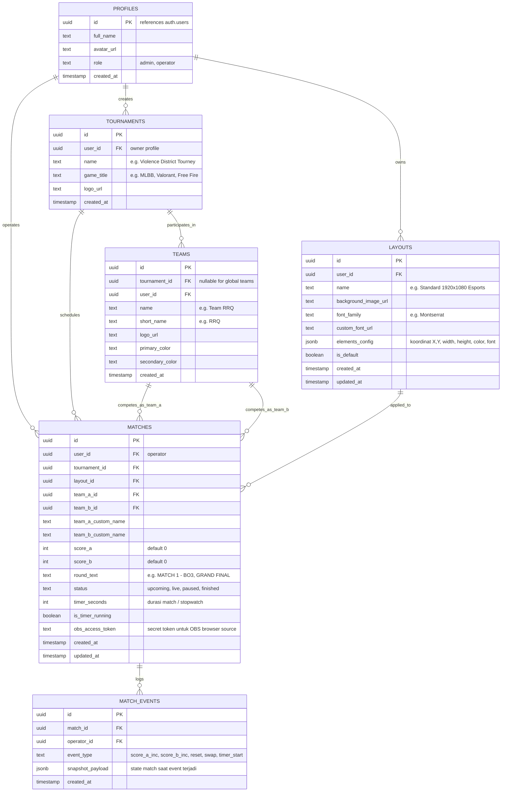
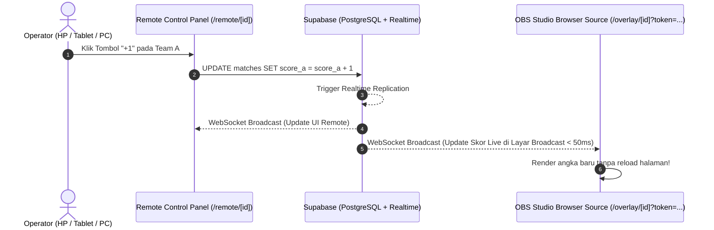

# 🛠️ Supabase Database Architecture & Integration Plan
**Project:** Velazta Remote Scoreboard (VVELCASTING)  
**Dokumen:** Perencanaan Arsitektur Database, ERD, dan Integrasi React/Next.js  
**Status:** Planning & Brainstorming  

---

## 📌 Daftar Isi
1. [Arsitektur Integrasi Supabase ke Next.js 16 (React 19)](#1-arsitektur-integrasi-supabase-ke-nextjs-16-react-19)
2. [Entity Relationship Diagram (ERD)](#2-entity-relationship-diagram-erd)
3. [Spesifikasi Skema Tabel & Data Dictionary](#3-spesifikasi-skema-tabel--data-dictionary)
4. [Supabase Storage Buckets & File Policy](#4-supabase-storage-buckets--file-policy)
5. [Realtime Synchronization Architecture (OBS & Remote)](#5-realtime-synchronization-architecture-obs--remote)
6. [Row Level Security (RLS) & Akses Token OBS](#6-row-level-security-rls--akses-token-obs)
7. [Langkah Konfigurasi Supabase Project (VVELCASTING)](#7-langkah-konfigurasi-supabase-project-vvelcasting)

---

## 1. Arsitektur Integrasi Supabase ke Next.js 16 (React 19)

Untuk memastikan integrasi aman, berkinerja tinggi, dan kompatibel dengan **Next.js 16 App Router** serta **React 19**, kita menggunakan `@supabase/ssr` yang memisahkan client sesuai konteks eksekusinya:



### Konfigurasi Klien (Clients Setup)
1. **Browser Client (`lib/supabase/client.ts`)**: Digunakan di *Client Components* (seperti Remote Controller, Canvas Editor, dan OBS Overlay) untuk operasi interaktif dan subscription Realtime.
2. **Server Client (`lib/supabase/server.ts`)**: Digunakan di *Server Components*, *Server Actions*, dan *Route Handlers* dengan penanganan cookie otomatis.
3. **Middleware Client (`middleware.ts`)**: Sudah terpasang untuk validasi session dan perlindungan rute (`/custom`, `/panel`, dsb.).
4. **Environment Variables (`.env.local`)**:
   ```env
   NEXT_PUBLIC_SUPABASE_URL=https://<your-project-id>.supabase.co
   NEXT_PUBLIC_SUPABASE_ANON_KEY=eyJhbGciOi...
   SUPABASE_SERVICE_ROLE_KEY=eyJhbGciOi... # (Hanya untuk backend/seed script)
   ```

---

## 2. Entity Relationship Diagram (ERD)

Berikut adalah diagram relasi database untuk sistem Esports Scoreboard Overlay & Remote Controller:



---

## 3. Spesifikasi Skema Tabel & Data Dictionary

### A. Tabel `profiles`
Menyimpan data pengguna yang terhubung otomatis dengan Supabase Auth (`auth.users`).
- `id` (UUID, PK): Menunjuk ke `auth.users.id` (CASCADE on delete).
- `full_name` (TEXT)
- `avatar_url` (TEXT)
- `created_at` (TIMESTAMPTZ, Default `now()`)

### B. Tabel `layouts` (Inti dari Custom Canvas Editor)
Menyimpan konfigurasi posisi kanvas 1920x1080 dalam format JSONB yang sangat fleksibel untuk `react-rnd`.
- `id` (UUID, PK, Default `gen_random_uuid()`)
- `user_id` (UUID, FK `profiles.id`)
- `name` (TEXT) - Nama layout preset.
- `background_image_url` (TEXT) - Gambar latar 1920x1080 di Supabase Storage.
- `font_family` (TEXT) - Nama font yang digunakan.
- `custom_font_url` (TEXT) - URL file `.ttf`/`.woff2` kustom.
- `elements_config` (JSONB) - Struktur koordinat komponen overlay:
  ```json
  {
    "team_a_name": { "x": 280, "y": 80, "width": 180, "height": 45, "fontSize": 24, "fontColor": "#FFFFFF", "align": "center" },
    "team_a_score": { "x": 480, "y": 70, "width": 70, "height": 65, "fontSize": 42, "fontColor": "#FFD700", "align": "center" },
    "team_b_score": { "x": 570, "y": 70, "width": 70, "height": 65, "fontSize": 42, "fontColor": "#FFD700", "align": "center" },
    "team_b_name": { "x": 660, "y": 80, "width": 180, "height": 45, "fontSize": 24, "fontColor": "#FFFFFF", "align": "center" },
    "round_info": { "x": 510, "y": 30, "width": 100, "height": 30, "fontSize": 14, "fontColor": "#CCCCCC", "align": "center" },
    "timer": { "x": 510, "y": 145, "width": 100, "height": 30, "fontSize": 18, "fontColor": "#FFFFFF", "align": "center" }
  }
  ```

### C. Tabel `matches` (Target Sinkronisasi Realtime Utama)
Setiap perubahan pada row tabel ini (skor bertambah, tim berubah, timer berjalan) akan langsung dipancarkan via WebSocket ke OBS Studio dan Remote Control Panel.
- `id` (UUID, PK)
- `user_id` (UUID, FK `profiles.id`)
- `layout_id` (UUID, FK `layouts.id`)
- `score_a` (INT, Default `0`)
- `score_b` (INT, Default `0`)
- `team_a_custom_name` (TEXT, e.g. "SADNESS")
- `team_b_custom_name` (TEXT, e.g. "NBA")
- `round_text` (TEXT, e.g. "MATCH 01 - BO3")
- `status` (TEXT, Default `'live'`)
- `obs_access_token` (TEXT, Default `encode(gen_random_bytes(16), 'hex')`)
- `updated_at` (TIMESTAMPTZ, Default `now()`)

### D. Tabel `match_events` (Audit Log / History Undo-Redo)
Mencatat riwayat penambahan skor, pengurangan skor, atau reset untuk fitur "Undo" pada Remote Operator.
- `id` (UUID, PK)
- `match_id` (UUID, FK `matches.id`)
- `event_type` (TEXT: `'SCORE_A_INC'`, `'SCORE_B_INC'`, `'RESET'`, `'SWAP_TEAMS'`)
- `snapshot_payload` (JSONB: snapshot nilai `{score_a: 1, score_b: 0}`)
- `created_at` (TIMESTAMPTZ)

---

## 4. Supabase Storage Buckets & File Policy

Tiga storage bucket publik disiapkan untuk menampung aset visual:

| Bucket Name | File Type Allowed | Max File Size | Fungsi |
| :--- | :--- | :--- | :--- |
| `backgrounds` | `image/png`, `image/jpeg`, `image/webp` | 5 MB | Gambar kanvas background 1920x1080 |
| `fonts` | `font/ttf`, `font/woff`, `font/woff2` | 10 MB | File font kustom yang diinjeksi via `@font-face` |
| `team-logos` | `image/png`, `image/webp`, `image/svg+xml` | 2 MB | Logo tim esports |

---

## 5. Realtime Synchronization Architecture (OBS & Remote)



### Kode Realtime Listener di React Component:
```tsx
const channel = supabase
  .channel(`match:${matchId}`)
  .on(
    'postgres_changes',
    {
      event: 'UPDATE',
      schema: 'public',
      table: 'matches',
      filter: `id=eq.${matchId}`,
    },
    (payload) => {
      // Update state skor secara instan di overlay OBS
      setMatchData(payload.new);
    }
  )
  .subscribe();
```

---

## 6. Row Level Security (RLS) & Akses Token OBS

1. **Keamanan Panel Operator (`/custom`, `/panel`)**:
   - Dilindungi Supabase RLS: Operator hanya bisa membaca dan mengubah data match milik `auth.uid() = user_id`.
2. **Akses Khusus OBS Browser Source (`/overlay/[id]?token=[obs_access_token]`)**:
   - OBS Browser Source berjalan tanpa login sesi (public).
   - RLS Policy mengizinkan operasi `SELECT` secara publik **jika** token yang dikirimkan cocok dengan `obs_access_token` pada row tersebut. Ini mencegah orang lain menyadap atau mengubah skor dari luar.

---

## 7. Langkah Konfigurasi Supabase Project (VVELCASTING)

Karena project Anda di dashboard Supabase (`VVELCASTING`) sudah terhubung dengan repository GitHub `Velazta/RemoteScoreboardVelazta`:
1. Buat file migration SQL lokal di folder `supabase/migrations/`.
2. Buat helper `lib/supabase/server.ts` untuk melengkapi `lib/supabase/client.ts`.
3. Pasang environment variable pada file `.env.local` di komputer lokal Anda dengan API Keys dari Dashboard Supabase:
   - `Settings` -> `API` -> Ambil `Project URL` & `anon public key`.
